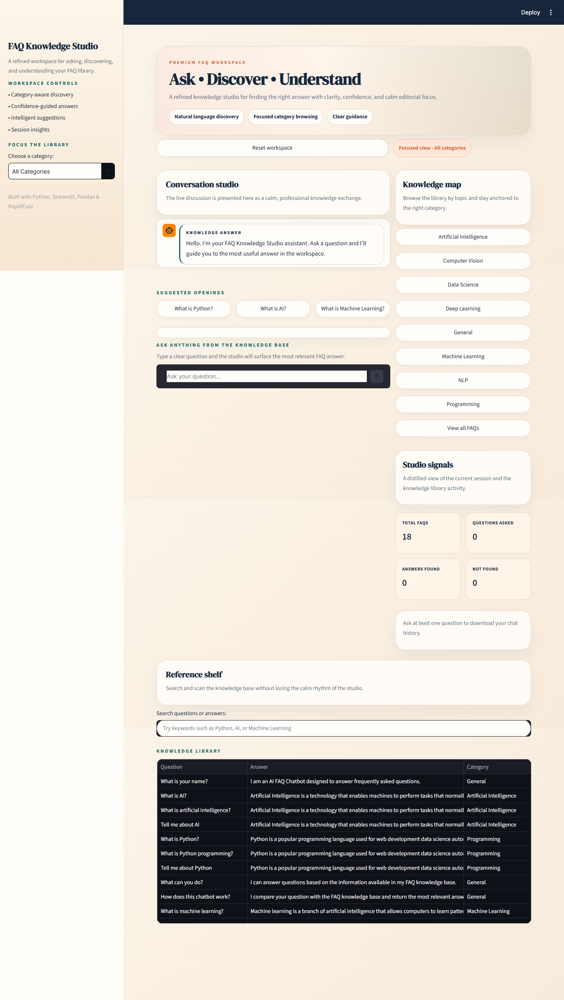
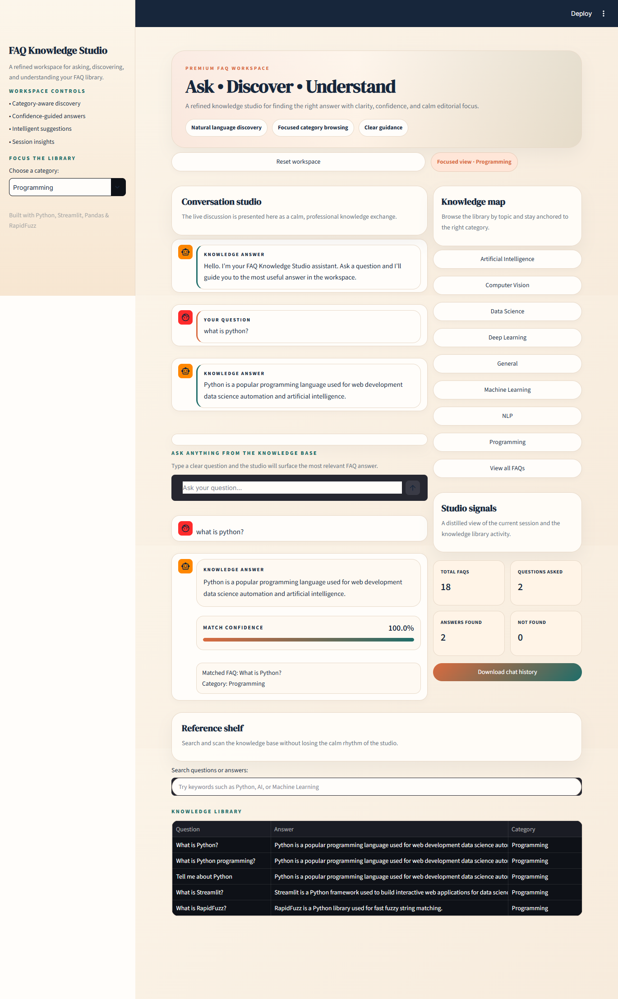
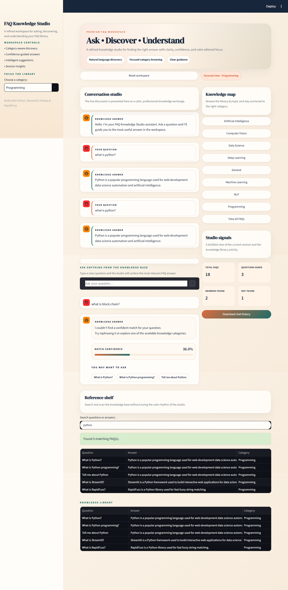
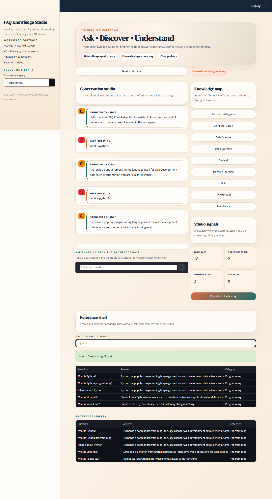

# ✦ FAQ Knowledge Studio

An AI-powered FAQ Chatbot built using **Python, Streamlit, Pandas, and RapidFuzz**.

FAQ Knowledge Studio allows users to ask questions and find the most relevant answers from a structured FAQ knowledge base using intelligent fuzzy matching, confidence scoring, category filtering, search functionality, and interactive session insights.

---

# 📌 Project Overview

FAQ Knowledge Studio is an intelligent FAQ knowledge-base application designed to help users quickly discover answers to frequently asked questions.

The application uses **RapidFuzz fuzzy matching** to compare user questions with stored FAQ questions and identify the most relevant answer.

The project provides a modern user interface with FAQ question answering, category filtering, no-match suggestions, searchable knowledge base, confidence scores, and session analytics.

The application is built using **Streamlit** and is designed to provide a professional and user-friendly AI-powered knowledge discovery experience.

---

# ✨ Features

✔️ Modern Premium UI Design

✔️ AI-Powered FAQ Question Matching

✔️ Natural Language Question Search

✔️ RapidFuzz Fuzzy Matching

✔️ Match Confidence Score

✔️ Category-Based FAQ Filtering

✔️ No-Match Question Suggestions

✔️ FAQ Search Feature

✔️ Knowledge Base Browser

✔️ Studio Session Analytics

✔️ Chat History Download

✔️ Responsive Streamlit Interface

---

# 🛠️ Technologies Used

| Technology | Purpose                   |
| ---------- | ------------------------- |
| Python     | Programming Language      |
| Streamlit  | Web Application Framework |
| Pandas     | FAQ Data Processing       |
| RapidFuzz  | Fuzzy Question Matching   |
| HTML       | Web Page Structure        |
| CSS        | Custom UI Styling         |
| CSV        | FAQ Knowledge Base        |

---

# 📂 Project Structure

```text
FAQ_Chatbot
│
├── __pycache__
│   └── app.cpython-313.pyc
│
├── screenshots
│   ├── Category_Filter.png
│   ├── Home_Page.png
│   ├── No_Match_Found.png
│   ├── Python_FAQ Answer.png
│   └── Search_Feature.png
│
├── venv
│   ├── Include
│   ├── Scripts
│   ├── share
│   └── pyvenv.cfg
│
├── .gitignore
│
├── app.py
│
├── assets
│
├── faq.csv
│
├── index.html
│
├── README.md
│
├── requirements.txt
│
└── style.css
```

---

# 📸 Screenshots

### 🏠 Home Page



---

### 🐍 Python FAQ Answer


---

### 🗂️ Category Filter



---

### ❌ No Match Found



---

### 🔎 Search Feature



---

# ⚙️ Installation & Setup

### 1. Clone Repository

```bash
git clone https://github.com/Abhigna13/FAQ_Chatbot.git
```

---

### 2. Navigate to Project Folder

```bash
cd FAQ_Chatbot
```

---

### 3. Create Virtual Environment

```bash
python -m venv venv
```

---

### 4. Activate Virtual Environment

#### Windows

```bash
venv\Scripts\activate
```

#### macOS/Linux

```bash
source venv/bin/activate
```

---

### 5. Install Dependencies

```bash
pip install -r requirements.txt
```

---

### 6. Run Application

```bash
streamlit run app.py
```

---

### 7. Open Browser

```text
http://localhost:8501
```

---

# 🧠 How It Works

FAQ Knowledge Studio processes user questions through an intelligent matching workflow.

```text
User Question
      ↓
Text Cleaning
      ↓
Question Processing
      ↓
RapidFuzz Similarity Matching
      ↓
Confidence Score Calculation
      ↓
Best FAQ Selection
      ↓
Answer Display
```

The application compares the user's question with the questions stored in `faq.csv`.

If the similarity score reaches the required confidence level, the application displays the corresponding FAQ answer along with:

* Match Confidence
* Matched FAQ
* Category

If no confident match is found, the application displays alternative FAQ suggestions to help the user find a relevant question.

---

# 📊 Studio Analytics

The application provides session-level information including:

* Total FAQs
* Questions Asked
* Answers Found
* Questions Not Found
* Match Confidence
* Selected Category

The application also provides a **Download Chat History** option so users can save their current FAQ conversation.

---

# 🗃️ FAQ Knowledge Base

The FAQ knowledge base is stored in `faq.csv`.

The CSV file contains the following fields:

| Column   | Purpose                              |
| -------- | ------------------------------------ |
| Question | Frequently asked question            |
| Answer   | Answer corresponding to the question |
| Category | FAQ topic or category                |

The knowledge base can be easily updated by adding new questions, answers, and categories to the CSV file.

---

# 🔍 Search & Category Features

### Category Filtering

Users can select a specific category to focus the FAQ knowledge base on a particular topic.

### Search Feature

Users can search questions or answers using keywords such as:

```text
Python
AI
Machine Learning
```

The application displays matching FAQs from the selected knowledge category.

### No-Match Handling

When the application cannot find a confident match, it provides alternative FAQ suggestions instead of simply returning an empty response.

---

# 🚀 Future Enhancements

* AI/LLM-Based Answer Generation
* Semantic Search Using Embeddings
* Vector Database Integration
* Voice-Based Question Input
* Multilingual FAQ Support
* PDF and Document Knowledge Base
* RAG-Based Question Answering
* User Authentication
* Cloud Deployment
* Advanced Conversation Memory
* AI-Powered FAQ Generation

---

# 👨‍💻 Author

**Abhigna Nadupalli**

AI & Data Science Student

Python Developer | AI & Machine Learning Enthusiast

---

# ⭐ Support

If you like this project, please consider giving it a **⭐ Star** on GitHub.
